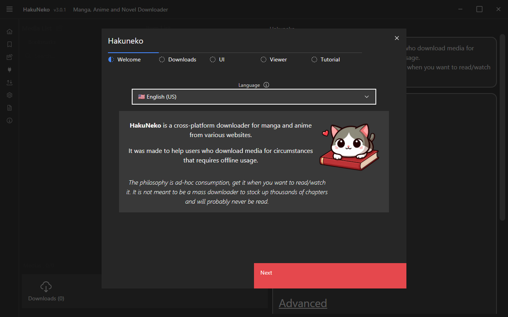
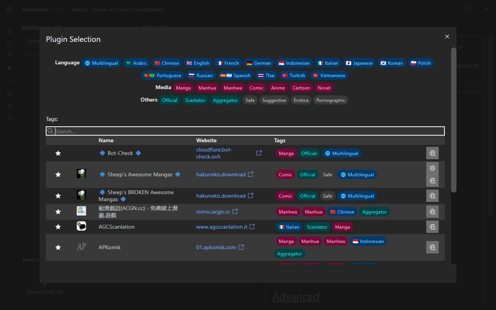
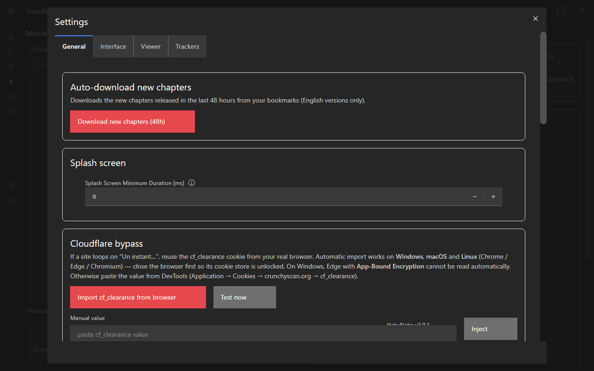

# ChainsmokerNeko 🚬🐱

[](https://github.com/Endymi0n74/ChainsmokerNeko/actions/workflows/push-ci.yml)


**Fork of [HaruNeko](https://github.com/manga-download/haruneko)** — desktop manga downloader.

## 📥 Download

👉 **[Releases](https://github.com/Endymi0n74/ChainsmokerNeko/releases/tag/3.0.3)** — Windows (x64/ia32/arm64)

## 📸 Screenshots





> Screenshots are regenerated with `node scripts/take-screenshots.mjs` (launches
> the Electron app against a local `vite preview` server).

## ✨ What this fork adds

- **CrunchyScan** / **JapScan** — Cloudflare bypass + captchas solved in visible window
- **MangaDrama** — in-app login, purchased chapters unlocked
- **MangaFire** / **Comix** — reliable listing, DRM-free
- Auto-import `cf_clearance` cookie from Edge/Chrome
- New chapter scan on startup (optional)

## 🔧 Development

```bash
npm ci
npm run build --workspace=web
npm run build --workspace=app/electron
./node_modules/electron/dist/electron.exe ./app/electron/build
```

## 📄 License

[Unlicense](UNLICENSE) — public domain.

---

*Built with vibe coding using [Codebuff](https://codebuff.com) (Kumo).*
